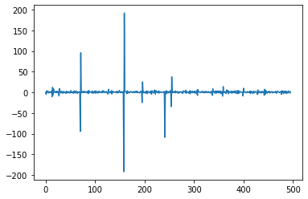

# sync-spotify
App to synchronise multiple Spotify accounts together (for group videochats)

The ```two_user.py``` function works pretty well, but only allows for two people to use the app at once, and the "host user" is fixed and unchanging. The ```syncer.py``` function aims for feature-completeness (many users, on-the-fly host switching) but its very buggy and not really in a fit state to run right now.

This is a WORK IN PROGRESS!
This means:
 - There are various debugging variables and console outputs littering the code
 - It may not work for various corner usecases
 - It is not fully featurecomplete
 - The presentation is rough
 
Watch this space!

What is it?
---
This script runs in the background and syncs up multiple spotify accounts to play in-sync. One user is designated as the "leader", and all other users follow what they do. If a non-leader user performs a manual action, that user becomes the new leader and everyone follows them instead.

The great feature that this app has is its ability to detect seek events - when a user skips forward or back in a track. There is no commercial product on the market capable of this, I think due to scaleability issues.

How does it work?
---
The seek-detect is the most interesting part, and it requires a very careful management of timing. Each time the program pings the spotify API, it checks the current progress of the playing track in milliseconds, and if it is more than 0.5s off from what it should be, a "seek" event is logged. In order to figure out what the time *should* be, however, multiple uncontrollable factors must be taken into consideration.
 1. The program itsself may take varying times to run due to different decision pathways
 2. The response from the API server may take varying times to return
 3. The execution of a requested action on a users account may take varying times to take place
This means that the time that has passed since the last ping is highly variable. To counter this, the time is measured to the highest resolution the system can attain and logged at every ping, so the program always knows how much time has elapsed since the last ping, and thus what the new timestamp should be (the old timestamp + the elapsed time).

To test this I set a random sleep time between 0-5 seconds to occur on every loop for 500 loops, and logged the difference between the predicted elapsed time and the actual elapsed time. The y-axis is the timing error in milliseconds.


The average error was 0.2ms, the average absolute error was 3ms, and the standard deviation was 14.9ms.

I set an error tolerance of 500ms to be safe, although the highest error I have ever recorded in any tests is only 400ms.

To Do:
---
 - [x] ~set up API authorisation token system for N users~
 - [x] ~detect new track event (change current track, pause, seek forward/back)~
 - [x] ~apply new track event globally to all users~
 - [x] ~account for latency delay in API calls~
 - [x] ~account for latency delay in client response~
 - [x] ~Fix edge cases (device change, connection loss, drop-in/drop-out, etc)~
 - [ ] Write unit tests
 - [ ] Make CLI
 - [ ] Make GUI (?)
 - [ ] Allow non-premium support (with ads) (?)

Known bugs to fix:
 - [ ] Doesn't work with podcasts
 - [ ] Messy transition between tracks in queue if device is laggy
